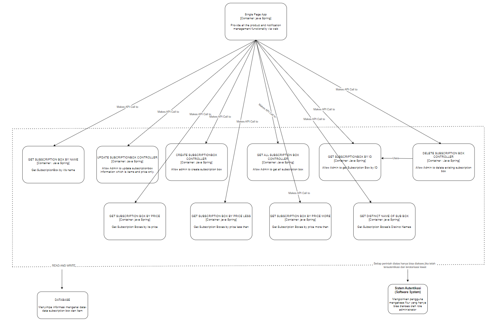

# tk-adpro
- C11
- 2206030754 Muhammad Faishal Adly Nelwan
- 2206081862 Yasmine Putri Viryadhani
- 2206081723 Reyhan Zada Virgiwibowo
- 2206041991 Ester Gracia
- 2206023023 Sita Amira Syarifah

# Context

# Container

# Deployment

# Component
## Review User

## Subscription Box Management Admin

## Subscription Management User

# Code
## Review User

## Admin Subscription

## Subscription Box Management Admin

## Subscription Management User

Risk storming adalah teknik kolaboratif di mana anggota tim dari berbagai peran berkumpul untuk mengidentifikasi, menilai, dan memprioritaskan risiko proyek. Pendekatan ini mendorong komunikasi terbuka dan memastikan pemahaman yang komprehensif tentang potensi risiko, yang mengarah pada manajemen risiko yang proaktif dan pengambilan keputusan yang tepat.

Dalam proyek kami, kami menggunakan risk storming untuk mengeksplorasi potensi risiko yang terkait dengan penerapan API Gateway Server. Hal ini memungkinkan kami untuk mengidentifikasi risiko teknis, operasional, dan keamanan, memastikan integrasi yang lancar, mengatasi masalah keamanan, dan mempertimbangkan kinerja serta skalabilitas. Dengan memprioritaskan risiko-risiko ini, kami mengembangkan rencana manajemen risiko yang menyeluruh untuk mengurangi potensi masalah secara efektif. Menerapkan API Gateway memberikan beberapa keuntungan:

API Gateway berfungsi sebagai titik masuk tunggal untuk semua permintaan klien, menyederhanakan manajemen dan pemantauan API.
Ini meningkatkan keamanan dengan mengelola autentikasi, otorisasi, dan perlindungan ancaman secara terpusat.
API Gateway dapat menyeimbangkan lalu lintas masuk di beberapa layanan dan menerapkan batasan kecepatan untuk mencegah kelebihan beban.
Dengan menyimpan tanggapan dalam cache dan mengalihkan tugas seperti terminasi SSL, API Gateway dapat meningkatkan kinerja sistem secara keseluruhan.
Ini memungkinkan integrasi mulus dari microservices baru dan API pihak ketiga, membuat sistem lebih mudah beradaptasi dengan perubahan.